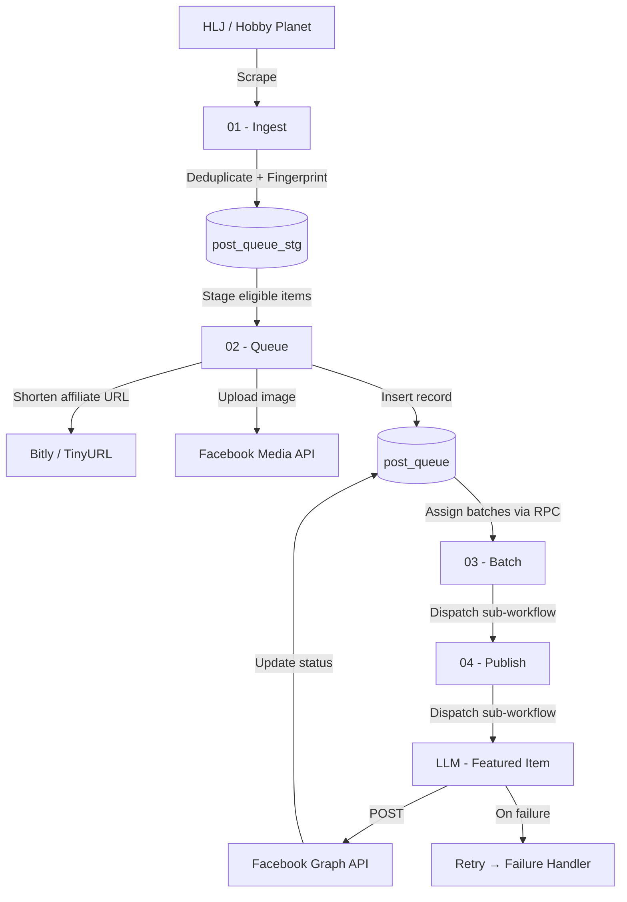
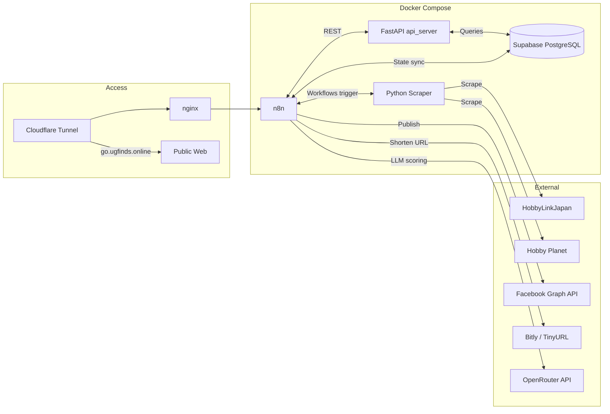

# Gunpla Scarcity Content Pipeline

A self-hosted automation pipeline that scrapes Gunpla low-stock listings, generates post copy, and publishes to Facebook.  
Runs on **n8n · Python · Supabase · Facebook Graph API · Docker Compose**

---

## Background

Inline with my interest in checking low-stock items, I came up with the idea to just do it myself.
To avoid burning out doing it manually on my FB page, I made a system that does it for me.
This project also helps exercise my visual-spatial brain and to eventually move to less visual tools like Airflow.

> [!NOTE]
> This is an AI-assisted project using Perplexity Pro for research, plausibility checks, and prototyping.
> 
> Some images will not load till you log in.

---

## Workflow Groups

The project is divided into several main workflow groups:

| Status | Group | Description |
|---|---|---|
| 🔄 In Progress | NEWS GATHERING | Gathers relevant news from different sources using LLM |
| ✅ Live | AUTO CATEGORIZE | Uses a SELECT AI adjacent feature to generate queries and categorization |
| 🔄 In Progress | APPROVAL | Contains hooks for Gmail approval of posts |
| ✅ Live | FETCHING, BATCH AND POSTING | Posts fetched and approved items to social media |
| 🔄 In Progress | ARCHIVING | Archives posted items |

---

## Pipeline - Fetching, Batch and Posting

A four-stage automation pipeline that runs on a schedule:

```
HLJ / Hobby Planet Inventory Feed
↓
[01 - Ingest]
Scrape → Deduplicate by SKU → Filter low-stock
→ Generate content fingerprint → Stage to DB
↓
[02 - Queue]
Load staged items → Build post copy
→ Shorten affiliate URL (Bitly / TinyURL fallback)
→ Upload image to Facebook → Insert post_queue record
↓
[03 - Batch]
Schedule trigger → Assign post_queue items to publish batches
→ Loop over batches → Call publish sub-workflow
↓
[04 - Publish]
Fetch batch items → Post to Facebook (Primary + Retry)
→ Evaluate response → Update post_queue + post_queue_batch + post_queue_stg
↓
Facebook Post Live
```

**Tools / Tech Used:** n8n · Python 3.11 · Playwright · Supabase (PostgreSQL) · FastAPI · Facebook Graph API · Bitly API · OpenRouter (llama-3.3-70b) · Docker Compose · nginx

---

## Architecture

### Pipeline Flow



### Infrastructure


---

> [!NOTE]
> ## **Features**
> - Fetches low-stock items from HobbyLinkJapan and Hobby Planet
> - Analyzes and categorizes items using a SELECT AI adjacent LLM feature
> - Posts to Facebook by batch with affiliate URL shortening
> - PostgreSQL via Supabase to monitor staging, queueing, batching, and item status
> - Deduplication by SKU with content fingerprinting
> - Allows reposting after a configurable date range

---

# WORKFLOW AND DATABASE PROCESS:
> [!NOTE]
> - Only selected workflow and database, request for full demo

---

## WORFLOW:


### Queueing - Uploading FB image


### Posting in FB


### Selecting featured item


---

## DATABASE (completed status):

### Staging


### Post queue


### Post queue batch


---

# SAMPLE N8N OUTPUT:
> [!NOTE]
> - Simplified

## Queueing - Uploading FB image
```
[
  {
    "id": "432d465d-6bc7-4de4-8818-a4dadb3357c7",
    "stg_status": "posted",
    "post_queue_id": "614302ab-ea40-47c9-8de2-823a202524f5",
    "ingested_at": "2026-05-02T15:13:46.387044+00:00",
    "ingested_by": "n8n-workflow",
    "source_system": "hlj-scraper",
    "content_hash": "9696exxxxxxxxxxxxxxxxxxxxxxxxxxxxxxxxxxxxxxxxxxxxxxxxxxxxxxxx67x",
    "batch_queue_id": null,
    "source_type": "hlj",
    "source_id": "BANH638397-UP",
    "post_copy": "<<placeholder>>",
    "image_urls": [
      "https://www.hlj.com/productthumbs/ban/banh638397-up_0_1756944545.jpg"
    ],
    "affiliate_url": "https://www.hlj.com/1-100-scale-mg-master-gundam-banh638397-up?utm_source=samp&utm_medium=affiliate",
    "fb_media_ids": [
      "1234324247534468"
    ],
    "channel": "facebook",
    "urgency": 5,
    "tier": "2",
    "mobile_suit": "1/100 MG Master Gundam",
    "tags": [
      "hlj",
      "low-stock"
    ],
    "created_at": "2026-05-02T15:13:46.387044+00:00",
    "updated_at": "2026-05-02T15:18:11.283353+00:00",
    "name": "1/100 MG Master Gundam",
    "stock": "Only 2 left in stock.  Order now!",
    "ai_notes": null,
    "ai_processed": false,
    "sku": "BANH638397-UP",
    "gradescale": "MG 1/100",
    "scraped_at": "2026-05-02T15:02:36+00:00",
    "currency_source": "JPY",
    "price_jpy": 4006
  }
 ]
```
## Batch Assignment

```
[
  {
    "batch_id": "5b1ea8e9-9c55-44b3-b436-5ad079fc1e35",
    "message": "Daily Item finds! \n**HLJ Low stock**",
    "copy_message": "1/100 MG Master Gundam\n¥4006 · ₱1511.51 · $25.23 · S$32.27 · RM99.79 · ฿822.83 · Rp432,648\n2 left · https://bit.ly/49r31Tt\n---\nGundam Decal No.54 Gundam 0080 Series Decals #2\n¥626 · ₱236.17 · $3.94 · S$5.04 · RM15.59 · ฿128.58 · Rp67,608\n5 left · https://www.hlj.com/gundam-decal-no-54-gundam-0080-series-decals-2-banh611499-up?utm_source=speedartug&utm_medium=affiliate\n---\nGundam Decal No.139 Mobile Suit Gundam GQuuuuuuX General Purpose 1\n¥626 · ₱236.17 · $3.94 · S$5.04 · RM15.59 · ฿128.58 · Rp67,608\n5 left · https://bit.ly/42uECZD\n---\n1/144 HGUC Revive RX-178 Gundam Mk-II AEUG Version\n¥2128 · ₱802.99 · $13.4 · S$17.14 · RM53.01 · ฿437.09 · Rp229,824\n5 left · https://www.hlj.com/1-144-scale-hguc-revive-rx-178-gundam-mk-ii-aeug-version-bann01311?utm_source=speedartug&utm_medium=affiliate\n---\nSD Sangoku Soketsuden Zhao Yun 00 Gundam & Ao Ryusuke\n¥1502 · ₱566.82 · $9.46 · S$12.1 · RM37.41 · ฿308.51 · Rp162,216\n5 left · https://tinyurl.com/2aod5k65",
    "attached_media": [
      {
        "media_fbid": "12343242475344681"
      },
      {
        "media_fbid": "12343242475344682"
      },
      {
        "media_fbid": "12343242475344683"
      },
      {
        "media_fbid": "12343242475344684"
      },
      {
        "media_fbid": "12343242475344685"
      }
    ]
  },
  {
    "batch_id": "7a3907b8-6129-4923-b44b-25e55ea64b1f",
    "message": "Daily Item finds! \n**HLJ Low stock**",
    "copy_message": "Gunpla Package Art Acrylic Stand Suletta Mercury\n¥1252 · ₱472.35 · $7.89 · S$10.08 · RM31.19 · ฿257.16 · Rp135,216\n2 left · https://tinyurl.com/2ba8lygg\n---\nBJ-03 Ball Joint 3mm\n¥238 · ₱89.75 · $1.5 · S$1.92 · RM5.93 · ฿48.89 · Rp25,704\n5 left · https://www.hlj.com/bj-03-ball-joint-3mm-wavop-371?utm_source=speedartug&utm_medium=affiliate",
    "attached_media": [
      {
        "media_fbid": "12343242475344689"
      },
      {
        "media_fbid": "12343242475344680"
      }
    ]
  }
]
```

## Posting in FB

```
[
  {
    "sku": "BANH638397-UP",
    "batch_id": "432d465d-6bc7-4de4-8818-a4dadb3357c7",
    "posted_at": "2026-05-02T15:21:31.381Z"
  },
  {
    "sku": "WAVOP-371",
    "batch_id": "306acb3a-f217-4811-8f20-04e92ac6a2b2",
    "posted_at": "2026-05-02T15:22:20.085Z"
  }
]
```


## Build Log

- [x] Low-stock scraper
- [x] Facebook Graph API setup
- [x] Supabase setup
- [x] Credentials setup
- [x] Ingest workflow
- [x] Create Post workflow
- [x] Batch workflow
- [x] Publish workflow
- [ ] Approval workflow
- [ ] News gathering workflow
- [ ] Archiving workflow
- [ ] Telegram alert

---

## Challenges Encountered

- [x] Facebook Graph API setup
- [x] Getting the sub-workflow running
- [x] Avoid AI from doing nuclear fix
- [x] LLM thread continuity
- [x] Error handling
- [x] Supabase HTTPS
- [x] Credentials sync with other machine

---

## Monitoring

- Workflow execution status tracked via n8n's built-in execution log
- Post pipeline state queryable via Supabase `post_queue` status fields
- [planned] Telegram alert on workflow failure

---

## Repository Structure

```
gunpla_project_1/
├── app/                          # FastAPI backend
│   ├── scrapers/                 # HLJ, Hobby Planet scrapers + base class
│   ├── comparison.py             # Price comparison engine
│   ├── config.py                 # Pydantic settings (loads from .env)
│   ├── database.py               # Supabase DB client
│   └── logger.py                 # Structured logging
├── m-hub-db/                     # Supabase schema & RPC functions
│   └── database/
│       ├── function/             # assign_all_batches, import_post_queue_stg
│       └── sql/                  # post_queue, post_queue_batch, post_queue_stg DDL
├── nginx/                        # Reverse proxy config (go.ugfinds.online)
├── scripts/
│   ├── hlj-lowstock/             # Standalone HLJ low-stock tracker
│   ├── powershell/               # n8n workflow + credential import/export utilities
│   └── shellscript/              # Facebook token exchange
├── tests/                        # pytest scraper test suite
├── workflows/                    # n8n workflow JSON exports (01–04)
├── api_server.py                 # FastAPI entry point
├── scheduler.py                  # APScheduler-based task runner
├── docker-compose.yml            # Full stack orchestration
├── Dockerfile.scraper            # Scraper container image
└── requirements.txt              # Python dependencies
```

---


## 🧑‍💻 About

**Arvin Torralba** - AI Automation Engineer
Self-hosted n8n · Python · Supabase · Facebook Graph API · Docker Compose

🔗 [GitHub](https://github.com/am-torr)
